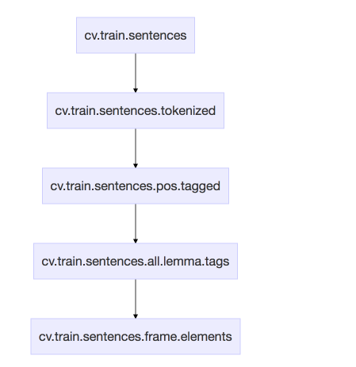
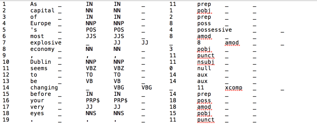

# SEMAFOR training

This is a README for training on the FrameNet 1.7 full text annotations which refers to [Noah's training readme file](https://github.com/Noahs-ARK/semafor/tree/master/training).

Abhinav Agrawal, axa172932@utdallas.edu, 07/05/2017.

Training models for frame-semantic parsing with SEMAFOR is a very laborious and 
time-consuming. Your kind patience is required to train the models.

### Checkout the code:

```
git clone git@github.com:Noahs-ARK/semafor.git
cd semafor
```

Modify the variables in `./bin/config.sh` as needed.

Run:

```
mvn package
```

Make sure you have the required data.
You can download FrameNet 1.7 [here](https://utdallas.box.com/s/ma5s14qf9aphes5d2hro7d5x9q98g3zx), but
also please fill out the request form [here](https://framenet.icsi.berkeley.edu/fndrupal/framenet_data)
if you haven't already.
Set the `luxmldir` environment variable in `training/config` to point at the `lu` folder.
The train/dev/test splits that were used in the NAACL '12 and subsequent papers can be found
[here](http://www.cs.cmu.edu/~ark/SEMAFOR/naacl2012_splits_with_rank_score.tar.gz).


### 1. Data structure preparation 1/2

Used to train and test the frame identification and argument identification models (please refer to [NAACL 2010 paper](https://homes.cs.washington.edu/~nasmith/papers/das+schneider+chen+smith.naacl10.pdf) to understand these two steps). The first step is to create two maps --  `framenet.original.map` and `framenet.frame.element.map`.
  1. The first map is of type `THashMap<String, THashSet<String>>`. It maps a frame to a set of disambiguated predicates (words along with part of speech tags, but in the style of FrameNet).
  2. The second map is of type `THashMap<String,THashSet<String>>`, which maps each frame to a set of frame element names. In other words, this data structure is necessary for the argument identification model to know what the frame elements are for each frame.

My versions of these two maps are present in semafor/SemaforMap/output/ directory (these are just serialized Java objects). 
Use the `semafor-deps.jar` file in `lib/` directory  to get the right version of GNU trove, and read (deserialize) these two maps. After that print the keys, and the corresponding values to see exactly what is 
stored in these maps. After that, you will need to create your own versions of these two maps for your domain, in exactly the same format as these maps. If you want existing code in SEMAFOR to create these maps, you could use the method `writeSerializedObject(Object object, String outFile`) in [SerializedObjects.java](https://github.com/sammthomson/semafor/blob/master/src/main/java/edu/cmu/cs/lti/ark/util/SerializedObjects.java) to write serialize those maps. So creating your own maps will be easy. You could also read the maps using that class.

For your convenience, I provide my code that generates these two maps in SemaforMap/ folder. In my case, I simply add "Protest" related frames and lexical units into these 2 maps. You may add more if you prefer.

### 2. Data structure preparation 2/2

Used for training and inference procedure.
```
./training/2_createRequiredData.sh
```
Always make sure you run that ```java``` program in this shell script. Check if ```ln``` command is commented while configuration and ```java``` program is uncommented. This is very important since files generated by this step are going to be used by follwing shell scripts, especially for reqData.jobj. (The semafor author use ```ln``` for simplicity and speed reason but you should never use that unless you fully understand it)

### 3. Training the frame identification model

 `./training/trainIdModel.sh` consists of:

1. alphabet creation and combination:
  ```
  ./training/3_1_idCreateAlphabet.sh
  ```
  This takes ~1 min using 8 threads (AMD Opteron(TM) 6272 2.1MHz processors; using the "ancestor" model).

2. creating feature events for each datapoint:
  ```
  ./training/3_2_idCreateFeatureEvents.sh
  ```
  Takes ~3-4 minutes.

3. training the frame identification model:
  ```
  ./training/3_3_idTrainBatch.sh
  ```
  Takes ~40 minutes.
  Line search in L-BFGS may fail at the end, but that does not mean training failed. 
  In models_0.0, there will be models produced every few iterations. If line search failed, take the last model.

4. convert the alphabet file:
  ```
  ./training/3_4_idConvertAlphabetFile.sh
  ```
  Takes <1 minute.

### 4. Training the argument identification model

`./training/trainArgModel.sh` consists of:

1. alphabet creation:
  ```
  ./training/4_1_createAlphabet.sh
  ```
  Takes ~7 minutes.

2. caching feature vectors:
  ```
  ./training/4_2_cacheFeatureVectors.sh
  ```
  Takes ~10 minutes.

3. training:
  ```
  ./training/4_3_training.sh
  ```
  Takes ~ a day (in my case, it takes about 26 hours).
  This step has a regularization hyperparameter, lambda. You may tune lambda on a development set to get the best results.
  Note in this step, line search in L-BFGS may fail at the end, but that does not mean training failed. Check function values that is printed out at each iteration, if it does not change significantly, you may simply take the last generated model written to ```$data_dir$``` and copy it to your model destination folder. However, since intermediate model files have the name format ```argmodel.dat_xxx``` where ```xxx``` is a number, you need to change its name to ```argmodel.dat```. 
  
  In my case, it has little effect on the performance. 

### 5. Final Steps

1. copy ```engmalt.linear-1.7.mco``` from ```models``` directory provided by author to your model destination folder.

2. copy ```parser.conf.unlabeled``` from ```your model destination folder/scan``` to ```your model destination folder``` and rename it as ```parser.conf```

3. copy ```framenet.frame.element.map``` you generated to your model destination folder

4. copy ```sparsegraph.gz``` from ```models``` directory provided by author to your model destination folder.

5. change the environment variable ```MALT_MODEL_DIR``` to point to your new model directory

---

## Full Text Annotation Training Data Format

## File Generation Sequence



* tokenzieAndPosTag.sh
```sh
./bin/tokenizeAndPosTag.sh <input-file> <output-dir>
```
```
As capital of Europe 's most explosive economy , Dublin seems to be changing before your very eyes .
```
```
As_IN capital_NN of_IN Europe_NNP 's_POS most_JJS explosive_JJ economy_NN ,_, Dublin_NNP seems_VBZ to_TO be_VB changing_VBG before_IN your_PRP$ very_JJ eyes_NNS ._.
```

* runMalt.sh (dependency parser)
```sh
./semafor/bin/runMalt.sh <input-file> <output-dir>
```

output is in conll format



---
### cv.train.sentences
  1. one sentence per line.
  2. punctuations are separated from text by a space
  3. space separated
---
### cv.train.sentences.tokenized
  1. space separated
  2. one sentence per line

**Generated by calling tokenizeAndPosTag.sh**

---
### cv.train.sentences.pos.tagged
  1. one sentence per line
  2. space separated
  3. in each line, each term is in the format: token_posTag
  4. puctuation shuld be in this format:

  ```
  punctuation_punctuation
  ```

  Example
  ```
  Dublin_NNP and_CC the_DT Dubliners_NNPS

  As_IN capital_NN of_IN Europe_NNP 's_POS most_JJS explosive_JJ economy_NN ,_, Dublin_NNP seems_VBZ to_TO be_VB changing_VBG before_IN your_PRP$ very_JJ eyes_NNS ._.
  ```
  **Generated by calling tokenizeAndPosTag.sh**

---
### cv.train.sentences.all.lemma.tags
1) tab separated
2) Each line contains a sentence with annotations

refer to pos.tag file

|field 1| field 2| field 3| field 4| field 5|field 6|field 7|
|:-------------:|:-------------:|:-------------:|:-------------:|:-------------:|:-------------:|:-------------:|
|<sub><font size=2>number of words in the sentence (number of items for this line in pos tag file)</font></sub>|<sub><font size=2>n words of the sentence (tab separated)</font></sub>|<sub><font size=2>n POS tags corresponding to each word in previous field</font></sub>|<sub><font size=2>n tokens corresponding to dependency tree labels for each word's syntactic parent.</font></sub>|<sub><font size=2>n tokens corresponding to the index of each syntactic parent (0 is the dummy word, 1 is the first word, and so on).</font></sub>|<sub><font size=2>n tokens are '0'-s. These were there for providing the capability of using NE tags, but right now we don't use them.</font></sub>|<sub><font size=2>n tokens are lemmas for each word, computed using WordNet.</font></sub>|

Example

```
19	As	capital	of	Europe	's	most	explosive	economy	,	Dublin	seems	to	be	changing	before	your	very	eyes	.	IN	NN	IN	NNP	POS	JJS	JJ	NN	,	NNP	VBZ	TO	VB	VBG	IN	PRP$	JJ	NNS	.	prep	pobj	prep	poss	possessive	amod	amod	pobj	punct	nsubj	null	aux	aux	xcomp	prep	poss	amod	pobj	punct	11	1	2	8	4	8	8	3	11	11	0	14	14	11	14	18	18	15	11	O	O	O	O	O	O	O	O	O	O	O	O	O	O	O	O	O	O	O	as	capital	of	europe	's	most	explosive	economy	,	dublin	seem	to	be	change	before	your	very	eyes	.
```

**Generated by calling runMalt.sh**


---
### cv.train.sentences.frame.elements
1)  Each line corresponds to one predicate-argument structure
2)  tokens are tab separated.
3)  every line begins with ```1\t0.0```


|field 1|field 2|field 3|field 4|field 5|field 6|field 7|
|:--:|:--:|:--:|:--:|:--:|:--:|:--:|
|<sub><font size=2>counts the number of roles and the frame. E.g., if there are 2 roles, this number will be 3.|<sub><font size=2>the frame name|<sub><font size=2>the lexical unit.|<sub><font size=2>the token number (index of this token in sentence) of the actual target in the sentence (token numbers start with 0). If the target has multiple words, the token numbers will be series of numbers separated by _.|<sub><font size=2>the actual form of the target in the sentence.|<sub><font size=2>the sentence number in the corresponding *.all.lemma.tags file in which this predicate-argument structure appears. Again sentence numbers start from 0.|<sub><font size=2>role and span pairs. If the span contains more than one word, the span is denoted by start:end, where start is the index of the first word in the span, and end is the last one. The word indices again start from 0. (inclusive on both ends)|


Example

```
1	0.0	4	Economy	economy.n	7	economy	1	Political_region	3:4	Descriptor	5:6	Economy	7
```
